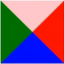

# 1 CSS三角

- 给一个宽高为0的盒子四个边框设置不同颜色会出现如下效果：

- 想要设置朝哪个方向的三角，只需将其他三个边框颜色设为透明即可，三角大小取决于边框粗细，参考代码如下：
  ~~~css
  div{
      width:0;
      height:0;
      line-height:0;
      font-size:0;
      border:10px solid transparent;
      border-left-color:pink;
  }
  ~~~

# 2 CSS用户界面样式

> 所谓界面样式，就是更改一些用户操作样式，以便提高用户体验

## 2.1 鼠标样式

|   属性值    | 描述 |
| :---------: | :--: |
|   default   | 默认 |
|   pointer   | 小手 |
|    move     | 移动 |
|    text     | 文本 |
| not-allowed | 禁止 |

## 2.2 取消表单轮廓

~~~css
outline:none|0;
~~~

## 2.3 防止表单域拖拽

~~~css
resize:none;
~~~

# 3 vertical-align的使用

- 使用场景：经常用于设置图片或表单和文字垂直对齐

- 限定：只针对行内元素或行内块元素有效

- 语法：
  ~~~css
  vertical-align:baseline|top|middle|bottom;
  ~~~

  - baseline：默认，元素放置在父元素基线上
  - top：把元素的顶端与行中最高元素的顶端对齐
  - middle：把此元素放置在父元素的中部
  - bottom：把元素的底端与行中最低的元素的底端对齐

- 理解几种线：
  

## 3.1 设置图片、表单和文字对齐

~~~css
vertical-align:middle;
~~~

## 3.2 图片底侧空白缝隙解决方案

- 原因：图片默认和文字基线对齐，会留出基线到底线的一段空隙

- 解决方案：

  1. 给img元素设置非基线对齐：
     ~~~css
     vertical-align:top|middle|bottom;
     ~~~

  2. 把图片转换成块级元素：
     ~~~css
     display:block;
     ~~~

# 4 溢出的文本用省略号显示

## 4.1 单行文本溢出

~~~css
/*1. 强制一行内显示文本*/
white-space:nowrap;	//默认normal自动换行
/*2. 超出的部分隐藏*/
overflow:hidden;
/*3. 文字用省略号代替超出的部分*/
text-overflow:ellipsis;
~~~

## 4.2 多行文本溢出

> 该方法有较大兼容性问题，适用于webKit浏览器或移动端

~~~css
overflow:hidden;
text-overflow:ellipsis;
/*弹性伸缩盒子模型显示*/
display:-webkit-box;
/*限制在一个块元素显示的文本的行数*/
-webkit-line-clamp:2;
/*设置或检索伸缩盒对象的子元素的排列方式*/
-webkit-box-orient:vertical;
~~~

